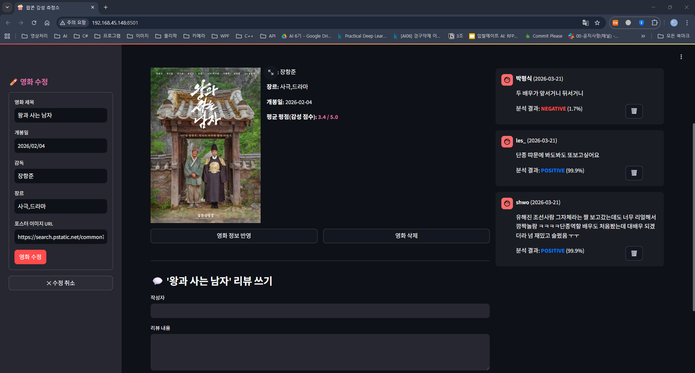

# 🍿 팝콘 감성 측정소 (Mood & Movie)

> 영화 리뷰를 작성하면 AI가 긍정/부정을 자동 분석하는 웹 서비스

---

## 서비스 화면

 

---

## 주요 기능

- **영화 갤러리** — 3열 그리드, 포스터·제목·평균 평점 표시
- **영화 CRUD** — 추가(중복 제목 감지), 수정, 삭제
- **리뷰 감성 분석** — 등록 즉시 KoELECTRA 모델이 긍정/부정 자동 판별
- **감성 탭 분류** — 전체 / 긍정 / 부정 탭 필터링
- **평균 평점** — 리뷰 감성 점수 평균을 0~5.0으로 환산

---

## 기술 스택

| 구분 | 기술 |
|---|---|
| 프론트엔드 | Streamlit |
| 백엔드 | FastAPI + Uvicorn |
| 데이터베이스 | SQLite (SQLAlchemy ORM) |
| 감성 분석 모델 | `daekeun-ml/koelectra-small-v3-nsmc` (ONNX Runtime) |
| 데이터 처리 | Pandas |

---

## 로컬 실행 방법

### 1. 의존성 설치

```bash
pip install -r requirements.txt
```

### 2. ONNX 모델 변환 (최초 1회)

```bash
python export_onnx.py
```

> `koelectra_onnx/` 폴더가 생성됩니다. 이미 존재하면 건너뜁니다.

### 3. 백엔드 서버 실행

```bash
python movie_backend.py
```

> `http://localhost:8000` — API 서버
> `http://localhost:8000/docs` — Swagger UI (API 명세 확인)

### 4. 프론트엔드 실행 (새 터미널)

```bash
streamlit run movie_frontend.py
```

> `http://localhost:8501` — 서비스 화면

---

## 프로젝트 구조

```
mission18/
├── movie_backend.py          # FastAPI 백엔드
├── movie_frontend.py         # Streamlit 프론트엔드
├── export_onnx.py            # KoELECTRA → ONNX 변환 스크립트
├── requirements.txt          # 의존성 목록
├── koelectra_onnx/           # ONNX 변환 모델 (export_onnx.py 실행 후 생성)
├── img/                      # 이미지 캡쳐본
├── movies.db                 # SQLite 데이터베이스
└── utils/
    └── icon.py
    
```

---

## 배포 구조

```
Streamlit Cloud (프론트엔드)
        ↕ REST API (HTTPS + CORS)
Railway / Render (FastAPI 백엔드, Docker)
        ↕ PostgreSQL
Supabase (클라우드 DB)
```

> 배포 상세 가이드 → [DEPLOY_GUIDE.md](DEPLOY_GUIDE.md)

---

## API 명세

| Method | Endpoint | 설명 |
|---|---|---|
| `POST` | `/movies/` | 영화 등록 |
| `GET` | `/movies/` | 영화 전체 조회 (평균 평점 포함) |
| `PUT` | `/movies/{id}` | 영화 수정 |
| `DELETE` | `/movies/{id}` | 영화 삭제 (리뷰 cascade 삭제) |
| `POST` | `/reviews/` | 리뷰 등록 + 감성 분석 |
| `GET` | `/reviews/` | 리뷰 조회 (최근 10건, `?movie_id=` 필터 가능) |
| `DELETE` | `/reviews/{id}` | 리뷰 삭제 |

---

*© 2026 팝콘 감성 측정소 — Built with Streamlit & FastAPI by Jarnfrid.Jang*
